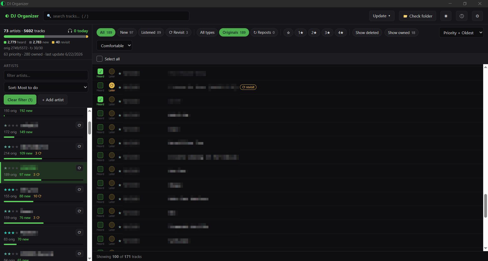

# DJ Track Organizer



A local, offline desktop app for organizing the tracks you want to work through.
It collects track **names and links** from SoundCloud artist pages, lets you sort
them by priority, mark what you've listened to or want to revisit, flag what you
already own, and keep the list updated. It never downloads or modifies audio files;
it only collects names and links, and everything stays on your computer.

> **Read this first.** This tool reads **public** SoundCloud pages through your own
> browser to collect names and links only. Please use it responsibly and respect
> SoundCloud's Terms of Service. It is provided **as is, with no warranty**; you are
> responsible for how you use it. It is **not affiliated with or endorsed by
> SoundCloud**. See [Disclaimer](#disclaimer).

## Features

- Collect originals and reposts from artist pages, with cross-artist repost merging
- Priority stars, status tracking (new / listened / revisit), and "owned" flagging
- "Check folder" matches a local music folder against your library by filename only,
  with a review step where you can play a match in your default player and untick false hits
- Capture each track's buy / free-download link and triage by where it points
- Careful, sequential, anti-bot-aware scraping that runs **logged out by default**
- Everything local: no account, no telemetry, no data leaves your machine

## Install

### Windows
1. Download `DJOrganizer_windows.zip` from the [latest release](https://github.com/JustBaneIsFine/dj-track-organizer/releases/latest).
2. Unzip it anywhere and run `DJOrganizer.exe`.
3. The app is not code-signed yet, so Windows SmartScreen may say "Windows protected
   your PC". Click **More info -> Run anyway**. (You can verify the source by building
   it yourself from this repo.)

### macOS (Apple Silicon)
1. Download `DJOrganizer_mac_apple-silicon.zip` from the latest release and unzip it.
2. The app is not notarized yet, so on first launch **right-click the app -> Open ->
   Open**. After that it launches normally.
3. Intel Macs: run from source (below).

### Run from source (any OS)
```bash
python -m venv .venv
# Windows:
.venv/Scripts/python -m pip install -r requirements.txt
.venv/Scripts/python -m playwright install chromium
.venv/Scripts/python main.py
# macOS / Linux:
# .venv/bin/python -m pip install -r requirements.txt
# .venv/bin/python -m playwright install chromium
# .venv/bin/python main.py
```
The app runs a local server and opens in a native window (WebView2 on Windows). If
the native window doesn't appear on Windows, install the
[WebView2 runtime](https://developer.microsoft.com/microsoft-edge/webview2/); the app
otherwise falls back to your default browser. Data lives at
`~/.dj-organizer/dj_organizer.db`.

## Updating

Download the new zip, delete your old `DJOrganizer` folder, and extract the new one in
its place. Your data is stored separately (see below), so it carries over untouched. The
app also shows an in-app banner when a newer release is available.

## Uninstall

Delete the `DJOrganizer` folder (or the `.app` on macOS). To also remove your data,
delete `~/.dj-organizer/` (on Windows, `%USERPROFILE%\.dj-organizer`); it holds the
database, logs, and saved browser login. If you want a backup first, use Export in Settings.

## Privacy

100% local. No accounts, no analytics, no telemetry. The only outbound network calls
are to SoundCloud while scraping, and a once-per-launch check to GitHub for a newer
release (you can turn that off in Settings). Your database, logs, and browser profile
stay in `~/.dj-organizer/` and are never uploaded.

## Scraping notes

Defaults are conservative on purpose: random delays between artists, a headed browser,
and strictly sequential requests. Scraping runs logged out by default, which keeps it
unconnected to any account. You can optionally point the app at a logged-in browser
profile in Settings if a page requires it; if you do, prefer a throwaway account over
your main one.

## Feedback

- Bugs and feature requests: [open an issue](https://github.com/JustBaneIsFine/dj-track-organizer/issues/new)
- Contact: djtezej@gmail.com

## Building a release

```bash
python build.py   # Windows onedir bundle in dist/DJOrganizer
```
See [RELEASE.md](RELEASE.md) for the tag-and-publish flow.

## Project layout

| Area | Where |
|---|---|
| Entry point | `main.py` |
| Paths + defaults | `config.py` |
| DB schema | `db/migrations/*.sql` (numbered) |
| All SQL | `db/queries.py` |
| Scraping engine | `scraper/engine.py` |
| SoundCloud DOM | `scraper/platforms/soundcloud.py` |
| API | `api/server.py`, `api/routes/*` |
| Background jobs | `api/scrape_manager.py` |
| Frontend | `frontend/` (Alpine.js, no build step) |

## Contributing

Issues and pull requests are welcome. Keep changes focused, match the existing style,
and don't add telemetry or anything that sends user data off the machine.

## License

[MIT](LICENSE). Use at your own risk.

## Disclaimer

This software is provided "as is", without warranty of any kind. The author is not
liable for any claim, damages, or other liability arising from its use. It reads
publicly accessible pages through your own browser and stores only names and links;
it does not download audio. You are solely responsible for ensuring your use complies
with SoundCloud's Terms of Service and applicable law. This project is not affiliated
with, authorized, or endorsed by SoundCloud.

## Contact

- **Email:** djtezej@gmail.com
- **Bug reports & feature requests:** [open an issue](https://github.com/JustBaneIsFine/dj-track-organizer/issues/new)
